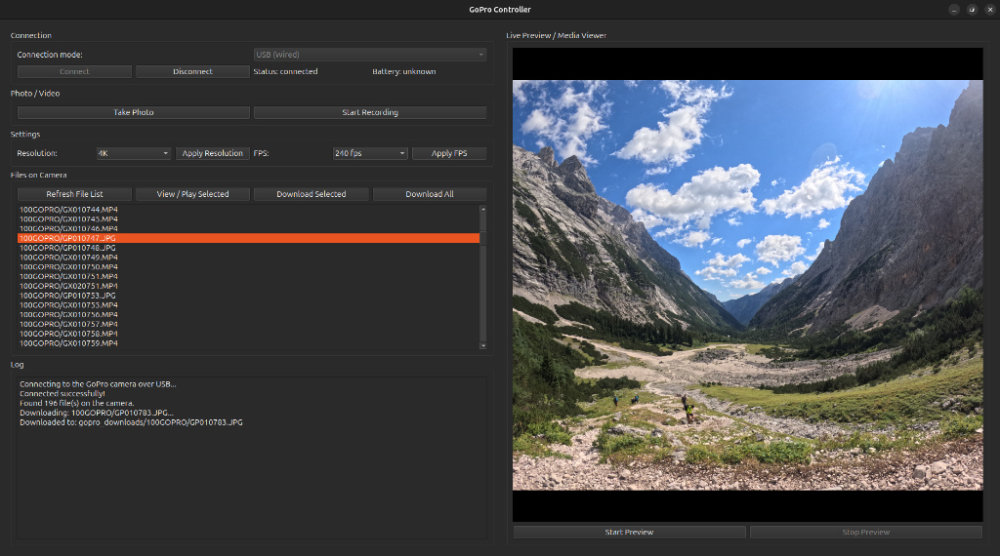
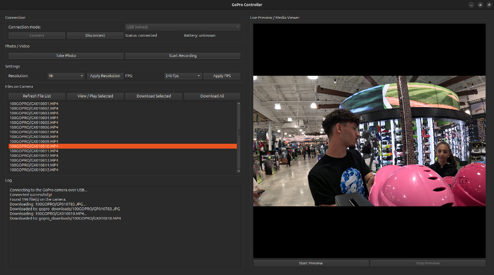
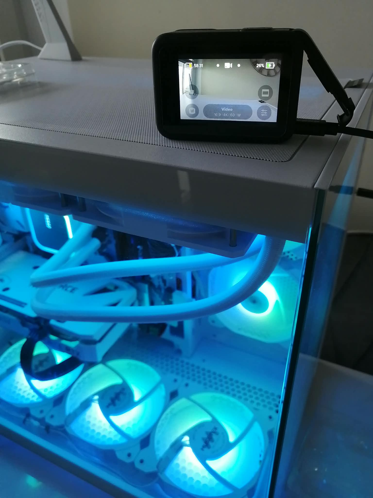

# GoPro Controller (PySide6 + Open GoPro)

A cross-platform (Linux / Windows / macOS) GUI application for controlling GoPro cameras, streaming low-latency live preview, and downloading or viewing media files stored on the camera.

This application utilizes the official **Open GoPro API** and bridges PySide6 with an asynchronous network event loop using a dedicated background asyncio thread.

---

## Screenshots

### 1. Live Stream Preview & Photo Viewer
Viewing downloaded high-resolution photos and streaming live video directly in the application panel:



### 2. Video Player & Media Management
Fetching the camera file list and playing recorded MP4/MOV videos seamlessly:



### 3. Hardware Setup (Wired USB Mode)
Connecting the GoPro camera directly via USB to the host computer:



---

## Key Features

* **Dual Connection Modes:**
  * **USB (Wired / WiredGoPro):** Fast, stable connection via USB cable.
  * **Wireless (BLE + Wi-Fi / WirelessGoPro):** Control over Bluetooth Low Energy and Wi-Fi.
* **Camera Controls:**
  * Capture photos (automatically switches to Photo mode).
  * Start and stop video recording (automatically switches to Video mode).
  * Adjust video resolution (4K, 2.7K, 1080p).
  * Change frame rates (240, 120, 60, 30 FPS).
  * Monitor real-time battery status.
* **Live Preview Stream:**
  * Receives low-latency UDP stream from the camera.
  * Decodes frames in real time using OpenCV and renders them within the Qt interface.
* **Media File Manager & Player:**
  * Browse the complete camera storage catalog.
  * Download individual files or batch download all media to `gopro_downloads/`.
  * Built-in viewer for images and media playback via `QtMultimedia` & `QMediaPlayer`.

---

## Requirements & Installation

### Prerequisites

* Python 3.9+
* OpenCV (for live preview decoding)
* PySide6 (Qt for Python GUI framework)
* `open-gopro` library (v0.22.0+)

### Setup Steps

1. Clone the repository:
   ```bash
   git clone [https://github.com/trdx87/gopro-controller.git](https://github.com/trdx87/gopro-controller.git)
   cd gopro-controller